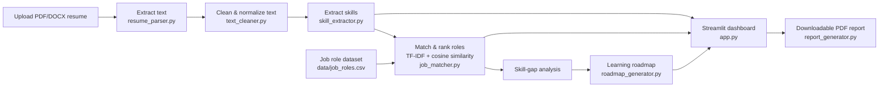

# AI Resume Analyzer & Job Recommendation System

An NLP-based Streamlit application that helps students understand how well
their resume matches selected job roles. It extracts resume text, identifies
technical skills, computes a match score against job-role requirements,
recommends the best-fitting roles, and generates a simple learning roadmap
for missing skills.

> **Educational tool.** This project is for guidance only - it does not make
> hiring or rejection decisions, and it never scores gender, age, religion,
> nationality, photographs, marital status, or disability. See
> [Responsible AI Rules](#responsible-ai-rules) below.

## Features

- Upload a resume as **PDF or DOCX** (validated for type and size).
- Extract and clean resume text (lowercased, noise removed, technical
  symbols like `C++`, `C#`, `.NET` preserved).
- Identify **skills** from a controlled dictionary of 49 technical skills
  across Programming, Databases, Data Handling, Machine Learning, NLP,
  Computer Vision, Cloud, and Tools categories.
- Compare the resume against **7 job roles** using **TF-IDF + cosine
  similarity** blended with direct skill overlap.
- Rank all roles and recommend the **top 3**.
- Show missing skills for the selected target role.
- Generate a **week-by-week learning roadmap** for closing skill gaps.
- Interactive **Streamlit dashboard** with a match-score chart.
- **Downloadable PDF report** summarizing the full analysis.
- Resumes are processed **in memory only** - nothing is written to disk.

## Architecture / Workflow



## Project Structure

```
ai_resume_analyzer/
|-- app.py                  # Streamlit dashboard (entry point)
|-- resume_parser.py        # PDF/DOCX text extraction + validation
|-- text_cleaner.py         # Text cleaning & normalization
|-- skill_extractor.py      # Skill dictionary matching
|-- job_matcher.py          # TF-IDF + cosine similarity role ranking
|-- roadmap_generator.py    # Rule-based learning roadmap
|-- report_generator.py     # Downloadable PDF report builder
|-- requirements.txt
|-- README.md
|-- .env                    # Optional API keys for future LLM feedback
|-- .gitignore
|-- data/
|   |-- job_roles.csv
|   |-- skill_dictionary.csv
|   `-- sample_resumes/     # Anonymized demo resumes (PDF + DOCX)
|-- reports/                # Generated PDF reports (git-ignored)
`-- tests/
    |-- test_cases.csv      # Manual evaluation sheet
    `-- test_core.py        # Automated unit tests (pytest)
```

## Setup

```bash
python -m venv .venv
.venv\Scripts\activate        # Windows
pip install -r requirements.txt
```

## Usage

```bash
streamlit run app.py
```

Then open the local URL Streamlit prints (usually `http://localhost:8501`),
upload a resume from `data/sample_resumes/` (or your own), pick a target
role, and review the match score, extracted skills, recommended roles, and
roadmap. Use the **Download report (PDF)** button to save the analysis.

## Running Tests

```bash
python -m pytest tests/ -v
```

`tests/test_cases.csv` also tracks manual evaluation results across the
three sample resumes (see [Testing and Evaluation](#testing-and-evaluation)).

## How Matching Works

1. **Skill extraction** - the cleaned resume text is searched for every
   skill in `data/skill_dictionary.csv` using whole-word/phrase regex
   matching (beginner approach: keyword matching).
2. **Text vectorization** - the resume text and each job role's required
   skills are converted into TF-IDF vectors.
3. **Cosine similarity** - similarity between the resume vector and each
   role vector is computed.
4. **Blended score** - the final match score is `50% cosine similarity +
   50% exact skill overlap`, scaled to 0-100%, which keeps the score both
   semantically aware and easy to explain to a student.
5. **Ranking** - roles are sorted by score; the top 3 are recommended.
6. **Skill gap** - skills required by the target role but absent from the
   resume become the "missing skills" list, which feeds the roadmap
   generator.

## Testing and Evaluation

Three anonymized sample resumes in `data/sample_resumes/` were used to
validate the pipeline end-to-end (see `tests/test_cases.csv`):

| Test Resume | Expected Top Role | Actual Top Role | Result |
|---|---|---|---|
| Resume A (data analyst) | Data Analyst | Data Analyst | Pass (68.1%) |
| Resume B (ML engineer) | Machine Learning Engineer | Machine Learning Engineer | Pass (43.3%) |
| Resume C (NLP engineer) | NLP Engineer | NLP Engineer | Pass (72.3%) |

Automated unit tests in `tests/test_core.py` cover text cleaning (protected
technical symbols, PII removal), skill extraction (true/false positives),
and role ranking/roadmap generation.

## Responsible AI Rules

- The tool is for **guidance**, not automatic hiring or rejection.
- It never scores gender, age, religion, nationality, photographs, marital
  status, or disability.
- It evaluates only job-related skills, education, projects, and relevant
  experience.
- Match scores are explicitly labeled as **estimates**, not recruiter
  decisions.
- Uploaded resumes are processed in memory for the session only and are
  never written to disk by the app.
- Missing keywords are not claimed to always mean missing ability - the
  dashboard's info panel states this directly to the user.

## Tools Used

| Part | Tool |
|---|---|
| Language | Python |
| PDF extraction | pypdf |
| DOCX extraction | python-docx |
| Text cleaning | Python + regex |
| Matching | TF-IDF + cosine similarity (scikit-learn) |
| Data handling | pandas, NumPy |
| Charts | Plotly |
| UI | Streamlit |
| Reports | ReportLab (PDF) |
| Version control | Git & GitHub |

## Limitations

- Skill detection relies on a controlled dictionary and keyword/phrase
  matching, so synonyms or unlisted skills may be missed (see
  [Suggested Viva Questions](#suggested-viva-questions)).
- Scanned/image-only PDFs without a text layer cannot be parsed (OCR is not
  included in the beginner pipeline).
- The job-role dataset is small and manually curated; scores reflect how
  closely a resume matches *this* dataset, not the entire job market.

## Optional Advanced Extensions

The current implementation follows the project brief's **beginner
approach** (keyword matching + TF-IDF + cosine similarity + rule-based
roadmap). Documented but not implemented here, for future extension:

- spaCy-based entity/phrase extraction and Sentence Transformers for
  semantic matching.
- LLM-generated resume feedback via Groq/Gemini/OpenAI with a controlled
  prompt.
- FastAPI backend, a database (SQLite/PostgreSQL), user login, and Docker
  deployment.

## Suggested Viva Questions

- How do you extract text from a resume?
- What is TF-IDF?
- What does cosine similarity measure?
- Why can keyword matching miss relevant skills?
- When should you use Sentence Transformers?
- Why should protected attributes be excluded?
- How is the match score calculated?
- What are the limitations of this project?
