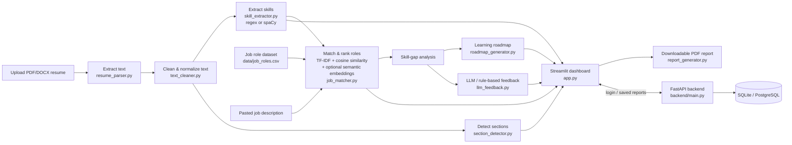

# AI Resume Analyzer & Job Recommendation System

An NLP-based Streamlit application that helps students understand how well
their resume matches selected job roles. It extracts resume text, identifies
technical skills, computes a match score against job-role requirements,
recommends the best-fitting roles, and generates a learning roadmap for
missing skills - with optional semantic matching, LLM-powered feedback,
and user accounts with saved reports.

> **Educational tool.** This project is for guidance only - it does not make
> hiring or rejection decisions, and it never scores gender, age, religion,
> nationality, photographs, marital status, or disability. See
> [Responsible AI Rules](#responsible-ai-rules) below.

## Features

### Core (beginner approach from the project brief)
- Upload a resume as **PDF or DOCX** (validated for type and size).
- Extract and clean resume text (lowercased, noise removed, technical
  symbols like `C++`, `C#`, `.NET` preserved).
- Identify **skills** from a controlled dictionary of 49 technical skills
  across Programming, Databases, Data Handling, Machine Learning, NLP,
  Computer Vision, Cloud, and Tools categories.
- Compare the resume against **7 job roles** using **TF-IDF + cosine
  similarity** blended with direct skill overlap.
- Rank all roles and recommend the **top 3**.
- Show missing skills for the selected target role and generate a
  **week-by-week learning roadmap**.
- Interactive **Streamlit dashboard** with a match-score chart and a
  **downloadable PDF report**.
- Resumes are processed **in memory only** unless a logged-in user
  explicitly saves a report.

### Advanced (optional, all implemented and toggleable)
- **Semantic matching**: Sentence-Transformers embeddings blended with
  TF-IDF and skill overlap, for resumes that phrase a skill differently
  than the job listing.
- **spaCy extraction**: `PhraseMatcher`-based skill extraction as an
  alternative to plain regex keyword matching.
- **Custom job description matching**: paste/compare against any job
  description instead of only the 7 predefined roles.
- **Resume section detection**: Education / Skills / Projects / Experience
  auto-split for review.
- **LLM-generated resume-improvement feedback** via a controlled,
  responsible-AI-constrained prompt (Groq by default; also supports OpenAI,
  Gemini, or a local OpenAI-compatible server such as Ollama) - falls back
  to deterministic rule-based feedback if no API key is configured.
- **Skill-dictionary feedback loop**: users can flag a skill that should
  have been detected; it's queued in
  `data/skill_dictionary_suggestions.csv` for human review before being
  promoted into the live dictionary.
- **Optional FastAPI backend** with user registration/login (JWT) and
  **saved analysis reports**, backed by SQLite or PostgreSQL. The
  dashboard detects whether the backend is reachable and enables/disables
  these features automatically - the core analysis works standalone either
  way.
- **Docker / docker-compose** deployment for both services.

## Architecture / Workflow



## Project Structure

```
ai_resume_analyzer/
|-- app.py                    # Streamlit dashboard (entry point)
|-- resume_parser.py          # PDF/DOCX text extraction + validation
|-- text_cleaner.py           # Text cleaning & normalization
|-- skill_extractor.py        # Skill dictionary matching (regex + spaCy)
|-- section_detector.py       # Resume section detection (optional feature)
|-- job_matcher.py            # TF-IDF + semantic + custom-JD role ranking
|-- roadmap_generator.py      # Rule-based learning roadmap
|-- llm_feedback.py           # LLM / rule-based resume feedback (optional)
|-- skill_feedback.py         # Skill-dictionary suggestion queue (optional)
|-- report_generator.py       # Downloadable PDF report builder
|-- backend_client.py         # Streamlit <-> FastAPI backend client
|-- backend/                  # Optional FastAPI backend
|   |-- main.py               # Routes: auth, saved reports
|   |-- database.py           # SQLAlchemy engine/session
|   |-- models.py             # User, SavedReport ORM models
|   |-- schemas.py            # Pydantic request/response schemas
|   |-- auth.py               # Password hashing + JWT
|   |-- crud.py                # DB operations
|   |-- requirements.txt
|   `-- Dockerfile
|-- Dockerfile                # Streamlit app image
|-- docker-compose.yml        # Runs frontend + backend together
|-- requirements.txt
|-- README.md
|-- PROJECT_REPORT.md         # Short project report (deliverable)
|-- .env                      # API keys / config (see below)
|-- .gitignore
|-- data/
|   |-- job_roles.csv
|   |-- skill_dictionary.csv
|   |-- skill_dictionary_suggestions.csv   # created at runtime
|   `-- sample_resumes/       # Anonymized demo resumes (PDF + DOCX)
|-- reports/                  # Generated PDF reports (git-ignored)
`-- tests/
    |-- test_cases.csv        # Manual evaluation sheet
    |-- test_core.py          # Automated unit tests (pytest)
    `-- test_backend.py       # Backend integration tests (pytest)
```

## Setup

```bash
python -m venv .venv
.venv\Scripts\activate        # Windows
pip install -r requirements.txt
python -m spacy download en_core_web_sm
```

Copy `.env` and fill in any optional keys (LLM provider, backend secrets) -
every value has a safe default and the app runs fully standalone with none
of them set.

## Usage

### Standalone (core features only)

```bash
streamlit run app.py
```

Open the local URL Streamlit prints (usually `http://localhost:8501`),
upload a resume from `data/sample_resumes/` (or your own), pick a target
role or paste a job description, and review the match score, extracted
skills, recommended roles, roadmap, and resume-improvement suggestions.

### With the optional backend (login + saved reports)

```bash
# Terminal 1
cd backend
pip install -r requirements.txt
uvicorn main:app --reload --port 8000

# Terminal 2 (project root)
streamlit run app.py
```

The sidebar will show a "Log in / Register" panel once it detects the
backend at `BACKEND_URL` (default `http://localhost:8000`). Logged-in users
can save an analysis report and revisit it later.

### With Docker

```bash
docker compose up --build
```

This starts both the FastAPI backend (port 8000) and the Streamlit
dashboard (port 8501), wired together automatically.

## Running Tests

```bash
python -m pytest tests/ -v
```

`tests/test_core.py` covers the resume-analysis pipeline (16 tests total,
including spaCy extraction, semantic-mode custom-JD matching, section
detection, and LLM-feedback fallback); `tests/test_backend.py` covers the
optional backend's auth and saved-report endpoints against a temporary
SQLite database. `tests/test_cases.csv` also tracks manual evaluation
results across the three sample resumes (see
[Testing and Evaluation](#testing-and-evaluation)).

## How Matching Works

1. **Skill extraction** - cleaned resume text is searched for every skill
   in `data/skill_dictionary.csv`, either via whole-word/phrase regex
   (beginner) or spaCy's `PhraseMatcher` (advanced - toggle in the sidebar).
2. **Text vectorization** - the resume text and each role's required
   skills (or a pasted job description) are converted into TF-IDF vectors;
   in advanced mode, Sentence-Transformers embeddings are computed too.
3. **Cosine similarity** - similarity between the resume vector and each
   role vector is computed for each signal available.
4. **Blended score** - beginner mode: `50% TF-IDF cosine + 50% skill
   overlap`. Advanced mode: `30% TF-IDF + 40% semantic embedding + 30%
   skill overlap`. Scaled to 0-100%.
5. **Ranking** - roles are sorted by score; the top 3 are recommended.
6. **Skill gap** - skills required by the target role but absent from the
   resume become the "missing skills" list, feeding both the roadmap
   generator and the resume-feedback module.

## Testing and Evaluation

Three anonymized sample resumes in `data/sample_resumes/` were used to
validate the pipeline end-to-end (see `tests/test_cases.csv`):

| Test Resume | Expected Top Role | Actual Top Role | Result |
|---|---|---|---|
| Resume A (data analyst) | Data Analyst | Data Analyst | Pass (68.1%) |
| Resume B (ML engineer) | Machine Learning Engineer | Machine Learning Engineer | Pass (43.3%) |
| Resume C (NLP engineer) | NLP Engineer | NLP Engineer | Pass (72.3%) |

## Responsible AI Rules

- The tool is for **guidance**, not automatic hiring or rejection.
- It never scores gender, age, religion, nationality, photographs, marital
  status, or disability - the skill dictionary and every extractor only
  look at technical/job-related terms, and the LLM-feedback prompt
  explicitly forbids mentioning protected attributes.
- It evaluates only job-related skills, education, projects, and relevant
  experience.
- Match scores are explicitly labeled as **estimates**, not recruiter
  decisions, in the UI, the PDF report, and the LLM feedback prompt.
- Uploaded resumes are processed in memory for the session only; they are
  written to a database only if a logged-in user explicitly clicks "Save
  this report."
- Missing keywords are not claimed to always mean missing ability - the
  dashboard's info panel and resume-feedback text both state this
  directly.

## Tools Used

| Part | Tool |
|---|---|
| Language | Python |
| PDF extraction | pypdf |
| DOCX extraction | python-docx |
| Text cleaning | Python + regex |
| Beginner matching | TF-IDF + cosine similarity (scikit-learn) |
| Advanced NLP extraction | spaCy |
| Advanced semantic matching | Sentence-Transformers |
| Data handling | pandas, NumPy |
| Charts | Plotly |
| UI | Streamlit |
| Reports | ReportLab (PDF) |
| Optional backend | FastAPI, SQLAlchemy, SQLite/PostgreSQL, JWT (python-jose), passlib |
| Optional AI feedback | Groq / OpenAI / Gemini / local (OpenAI-compatible API) |
| Deployment | Docker, docker-compose |
| Version control | Git & GitHub |

## Limitations

- Skill detection relies on a controlled dictionary; unlisted synonyms may
  be missed in beginner mode (advanced/semantic mode mitigates this).
- Scanned/image-only PDFs without a text layer cannot be parsed (OCR is
  not included in this pipeline).
- The predefined job-role dataset is small and manually curated; scores
  reflect fit against *this* dataset unless a custom job description is
  pasted in.
- LLM-generated feedback quality and cost depend on the configured
  provider/model and require your own API key.

## Suggested Viva Questions

- How do you extract text from a resume?
- What is TF-IDF?
- What does cosine similarity measure?
- Why can keyword matching miss relevant skills, and how does the
  Sentence-Transformers mode address that?
- When should you use Sentence Transformers over TF-IDF?
- Why should protected attributes be excluded, and how is that enforced
  here for both matching and LLM feedback?
- How is the match score calculated in beginner vs. advanced mode?
- What are the limitations of this project?
